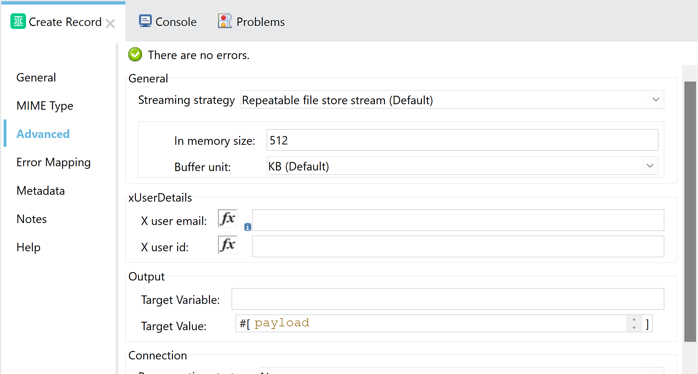
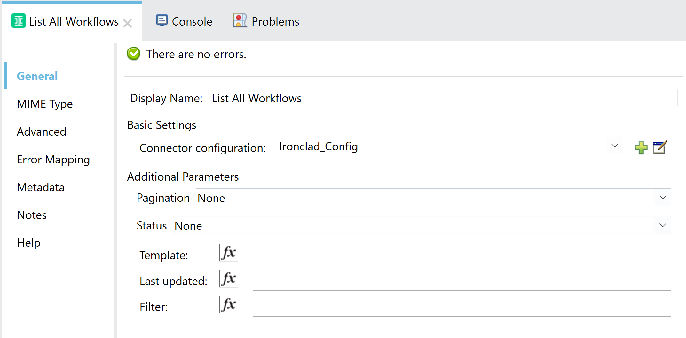

= Ironclad Connector

== Introduction
The Anypoint Ironclad Connector provides the capability to connect a Mule application to Ironclad, enabling retrieval of contract information and modification of existing contract schemas. This connector facilitates seamless integration with Ironclad's contract lifecycle management system, allowing businesses to automate contract-related workflows efficiently.
The connector exposes the following operations:

* Create Record
* Create Webhook
* Create a Workflow Asynchronously
* List All Records
* List All Workflow Approvals
* List All Workflow Signers
* List All Workflows
* Retrieve Record
* Retrieve Records Schema
* Retrieve Workflow
* Retrieve Workflow Schema
* Retrieve the Status of an Async Workflow Create Job
* Update Approval on a Workflow
* Update Record Metadata
* Update Workflow Metadata

== Prerequisites

[%header%autowidth]
|===
|Application/Service |Version
|Mule Runtime	     |  4.4 or later
|Ironclad API         |  v1
|Java	             |  1.8 and later
|===

This document assumes that you are familiar with Mule, Anypoint Connectors, Anypoint Studio, Mule concepts, elements in a Mule flow, and Global Elements.

You need the connected app to test your connection to your target resource.

For hardware and software requirements and compatibility
information, see the Connector Release Notes.

To use this connector with Maven, view the pom.xml dependency information in
the Dependency Snippets in Anypoint Exchange.

== Initial Steps to generate Ironclad connected app

Create an account in https://ironcladapp.com/, once created go to https://developer.ironcladapp.com/reference/register-oauth-client to configure a new connected app to start using the connector.

== Configuration
=== OAuth Client Credentials
```xml
<ironclad:ironclad-config name="Ironclad_Config" doc:name="Ironclad Config" doc:id="89df56b2-082b-4ce0-aec2-7a3cc816032b">
		<ironclad:client-credentials-connection clientId="Your_Client_Id" clientSecret="Your_Client_Secret" scopes="Your_Scopes" tokenUrl="https://ironcladapp.com/oauth/token" url="https://ironcladapp.com/public/api/v1" xUserEmail="Your_X_User_Email">
		</ironclad:client-credentials-connection>
</ironclad:ironclad-config>
```

=== OAuth Authorization Code
```xml
<ironclad:ironclad-config name="Ironclad_Config_Auth" doc:name="Ironclad Config" doc:id="51808610-5333-4bca-b783-4a54123b1039">
		<ironclad:authcode-connection url="https://ironcladapp.com/public/api/v1">
			<ironclad:oauth-authorization-code consumerKey="Your_Client_Id" consumerSecret="Your_Client_Secret" authorizationUrl="https://ironcladapp.com/oauth/authorize" accessTokenUrl="https://ironcladapp.com/oauth/token" scopes="Your_Scopes"/>
			<ironclad:oauth-callback-config listenerConfig="HTTP_Listener_config" callbackPath="/callback" authorizePath="/auth" externalCallbackUrl="Your_Callback_Url"/>	
	</ironclad:authcode-connection>
</ironclad:ironclad-config>
```


== Operations
For all operations properties, the required parameters are in the General tab and optional parameters in the Advanced tab for some operations. For most of the parameters it is enable to use an expression.

=== Create Record
Create a contract record by specifying its intended metadata properties.

==== Required Parameters

[options="header",width="50%"]
[source,code,linenums]
|============
|*Name*  |*Type* | *Description*
|Content| Object | Create a contract record by specifying its intended metadata properties.
|============

==== Optional Parameters
|============
|*Name*  |*Type* | *Description*
|X user email|String| Denotes the actor of the request. When used, the API will take into account this user's permissions and access. This or X user id is required when the associated token was produced from the Client Credentials grant.
|X user id|String| Denotes the actor of the request. When used, the API will take into account this user's permissions and access. This or X user email is required when the associated token was produced from the Client Credentials grant.
|============

==== Example




```xml
<ironclad:create-record doc:name="Create Record" doc:id="4b5e747c-2786-4fc8-8b45-6e0872c85d9b" config-ref="Ironclad_Config"/>
```

For more information about Create Record, please review https://developer.ironcladapp.com/reference/create-a-record

=== Create Webhook
Create a webhook for specified events. Separate requests are needed for multiple target URLs.

==== Required Parameters

[options="header",width="50%"]
[source,code,linenums]
|============
|*Name*  |*Type* | *Description*
|Configuration| String | Name of the configuration to use.
|Events| Array<String> | The event type(s) to trigger the webhook. Note: you can use * to receive events for all events.
|Target Url| String | The URL to send the webhook event payload to. It must be an HTTPS url.
|Headers| Object<Key,Value> | Additional headers to be received from the Webhook.
|============

==== Optional Parameters
|============
|*Name*  |*Type* | *Description*
|X user email|String| Denotes the actor of the request. When used, the API will take into account this user's permissions and access. This or X user id is required when the associated token was produced from the Client Credentials grant.
|X user id|String| Denotes the actor of the request. When used, the API will take into account this user's permissions and access. This or X user email is required when the associated token was produced from the Client Credentials grant.
|============

==== Example


```xml
<ironclad:create-webook doc:name="Create Webhook" doc:id="3c378def-b5f4-41ce-8b29-706e30dbce10" targetUrl="#[payload.targetUrl]" events="#[vars.events]" headers="#[payload.headers]" config-ref="Ironclad_Config"/>
```

For more information about Create Record, please review https://developer.ironcladapp.com/reference/create-a-webhook

=== Create a Workflow Asynchronously
Launch a new Workflow asynchronously for non-blocking performance, useful when providing files to the Workflow.

==== Required Parameters

[options="header",width="50%"]
[source,code,linenums]
|============
|*Name*  |*Type* | *Description*
|Configuration| String | Name of the configuration to use.
|Content| Object | Payload to launch a new workflow asynchronously.
|============

==== Optional Parameters
|============
|*Name*  |*Type* | *Description* | *Default Value*
|X user email|String| Denotes the actor of the request. When used, the API will take into account this user's permissions and access. This or X user id is required when the associated token was produced from the Client Credentials grant.| -
|X user id|String| Denotes the actor of the request. When used, the API will take into account this user's permissions and access. This or X user email is required when the associated token was produced from the Client Credentials grant.| -
|Use default values|Boolean| If values are not specified for a given field, use the default values specified in the launch form configuration.| false
|============

==== Example


```xml
<ironclad:create-workflow-async doc:name="Create Workflow Asynchronously" doc:id="f1a60a79-b398-47be-9e40-63c06c840b1d" config-ref="Ironclad_Config"/>
```

For more information about Create Record, please review https://developer.ironcladapp.com/reference/create-a-new-workflow-async

=== List All Records
View all records in the company, with filtering available via query parameters.

==== Required Parameters

[options="header",width="50%"]
[source,code,linenums]
|============
|*Name*  |*Type* | *Description*
|Configuration| String | Name of the configuration to use.
|============

==== Optional Parameters
|============
|*Name*  |*Type* | *Description* | *Default Value*
|Page|Number| The page number used when paginating through a list of results.| All
|Page size|Number| A limit of the number of results to return.| All
|Types|String| Comma separated (no spaces) record types to export. Use the Retrieve Records Schema endpoint to retrieve a list of types.| -
|Last updated|String| Get records updated since (UTC)| -
|Filter|String| Filter records using a formula. The record property ID should be enclosed in brackets [ ] and the value should be enclosed in single quotes ' '.| -
|Sort field|String| The field to sort Records. Only one field is supported in the sort operation.| agreementDate
|Sort direction|String| The direction the records are sorted by in correlation with the sortField.| DESC
|X user email|String| Denotes the actor of the request. When used, the API will take into account this user's permissions and access. This or X user id is required when the associated token was produced from the Client Credentials grant.| -
|X user id|String| Denotes the actor of the request. When used, the API will take into account this user's permissions and access. This or X user email is required when the associated token was produced from the Client Credentials grant.| -
|============

==== Example


```xml
<ironclad:list-all-records doc:name="List All Records" doc:id="f8a63634-eb59-4ef5-820e-31544aafa040" config-ref="Ironclad_Config"/>
```

For more information about Create Record, please review https://developer.ironcladapp.com/reference/list-all-records

=== List All Workflow Approvals
Retrieve a list of approvals for the workflow, displaying only triggered approvals.

==== Required Parameters

[options="header",width="50%"]
[source,code,linenums]
|============
|*Name*  |*Type* | *Description*
|Configuration| String | Name of the configuration to use.
|Id| String | The unique identifier or Ironclad ID of a workflow.
|============

==== Optional Parameters
|============
|*Name*  |*Type* | *Description* | *Default Value*
|X user email|String| Denotes the actor of the request. When used, the API will take into account this user's permissions and access. This or X user id is required when the associated token was produced from the Client Credentials grant.| -
|X user id|String| Denotes the actor of the request. When used, the API will take into account this user's permissions and access. This or X user email is required when the associated token was produced from the Client Credentials grant.| -
|============

==== Example


```xml
<ironclad:list-all-workflow-approvals doc:name="List All Workflow Approvals" doc:id="0c2d8f0a-1bcd-4051-be9c-07188c1d8a31" id="#[message.attributes.headers.id]" config-ref="Ironclad_Config"/>
```

For more information about Create Record, please review https://developer.ironcladapp.com/reference/list-all-workflow-approvals

=== List All Workflow Signers
Retrieve a list of workflow signers and their signature status.

==== Required Parameters

[options="header",width="50%"]
[source,code,linenums]
|============
|*Name*  |*Type* | *Description*
|Configuration| String | Name of the configuration to use.
|Id| String | The unique identifier or Ironclad ID of a workflow.
|============

==== Optional Parameters
|============
|*Name*  |*Type* | *Description* | *Default Value*
|X user email|String| Denotes the actor of the request. When used, the API will take into account this user's permissions and access. This or X user id is required when the associated token was produced from the Client Credentials grant.| -
|X user id|String| Denotes the actor of the request. When used, the API will take into account this user's permissions and access. This or X user email is required when the associated token was produced from the Client Credentials grant.| -
|============

==== Example


```xml
<ironclad:list-all-workflow-signers doc:name="List All Workflow Signers" doc:id="19ef3071-45f9-47b8-afef-55886731170a" id="#[message.attributes.headers.id]" config-ref="Ironclad_Config"/>
```

For more information about Create Record, please review https://developer.ironcladapp.com/reference/list-all-workflow-signers

=== List All Workflows
Retrieve all workflows in your Ironclad account.

==== Required Parameters

[options="header",width="50%"]
[source,code,linenums]
|============
|*Name*  |*Type* | *Description*
|Configuration| String | Name of the configuration to use.
|============

==== Optional Parameters
|============
|*Name*  |*Type* | *Description* | *Default Value*
|Page|Number| The page number used when paginating through a list of results.| All
|Page size|Number| A limit of the number of results to return.| All
|Status|Array<String>| Filter the workflows that are listed based on their status. If this parameter is omitted, active workflows will be returned. Active workflows include workflows in the Create, Review, Sign, and Archive stages. Also accepts multiple comma-separated statuses to get workflows in more than one status.| -
|Template|String| Filter workflows to a specific Template ID.| -
|Last updated|String| Retrieve workflows that have been updated since a UTC date.| -
|Filter|String| Filter workflows using a formula. The workflow attribute ID should be enclosed in brackets [ ] and the value should be enclosed in single quotes ' '.| -
|X user email|String| Denotes the actor of the request. When used, the API will take into account this user's permissions and access. This or X user id is required when the associated token was produced from the Client Credentials grant.| -
|X user id|String| Denotes the actor of the request. When used, the API will take into account this user's permissions and access. This or X user email is required when the associated token was produced from the Client Credentials grant.| -
|============

==== Example



```xml
<ironclad:list-all-workflows doc:name="List All Workflows" doc:id="be7b1923-f0fe-4b94-94a5-324d483182f8" config-ref="Ironclad_Config"/>
```

For more information about Create Record, please review https://developer.ironcladapp.com/reference/list-all-workflows

=== Retrieve Record
Retrieve a specific record and its associated data.

==== Required Parameters

[options="header",width="50%"]
[source,code,linenums]
|============
|*Name*  |*Type* | *Description*
|Configuration| String | Name of the configuration to use.
|Id| String | The ID or Ironclad ID of the Record.
|============

==== Optional Parameters
|============
|*Name*  |*Type* | *Description* | *Default Value*
|X user email|String| Denotes the actor of the request. When used, the API will take into account this user's permissions and access. This or X user id is required when the associated token was produced from the Client Credentials grant.| -
|X user id|String| Denotes the actor of the request. When used, the API will take into account this user's permissions and access. This or X user email is required when the associated token was produced from the Client Credentials grant.| -
|============

==== Example


```xml
<ironclad:retrieve-record doc:name="Retrieve Record" doc:id="d9cecf69-bc3b-49ac-8fa3-3a9332840f87" id="#[message.attributes.headers.id]" config-ref="Ironclad_Config"/>
```

For more information about Create Record, please review https://developer.ironcladapp.com/reference/retrieve-a-record

=== Retrieve Records Schema
Retrieve the schema associated with contract records, including available record types and metadata properties.

==== Required Parameters

[options="header",width="50%"]
[source,code,linenums]
|============
|*Name*  |*Type* | *Description*
|Configuration| String | Name of the configuration to use.
|============

==== Optional Parameters
|============
|*Name*  |*Type* | *Description* | *Default Value*
|X user email|String| Denotes the actor of the request. When used, the API will take into account this user's permissions and access. This or X user id is required when the associated token was produced from the Client Credentials grant.| -
|X user id|String| Denotes the actor of the request. When used, the API will take into account this user's permissions and access. This or X user email is required when the associated token was produced from the Client Credentials grant.| -
|============

==== Example


```xml
<ironclad:retrieve-records-schema doc:name="Retrieve Records Schema" doc:id="dc18f5fa-62ed-44bb-80b2-29b6fe93a0b6" config-ref="Ironclad_Config"/>
```

For more information about Create Record, please review https://developer.ironcladapp.com/reference/list-all-records-metadata

=== Retrieve Workflow
Retrieve the data associated with a specific workflow.

==== Required Parameters

[options="header",width="50%"]
[source,code,linenums]
|============
|*Name*  |*Type* | *Description*
|Configuration| String | Name of the configuration to use.
|Id| String | The unique identifier or Ironclad ID of a workflow.
|============

==== Optional Parameters
|============
|*Name*  |*Type* | *Description* | *Default Value*
|X user email|String| Denotes the actor of the request. When used, the API will take into account this user's permissions and access. This or X user id is required when the associated token was produced from the Client Credentials grant.| -
|X user id|String| Denotes the actor of the request. When used, the API will take into account this user's permissions and access. This or X user email is required when the associated token was produced from the Client Credentials grant.| -
|============

==== Example


```xml
<ironclad:retrieve-workflow doc:name="Retrieve Workflow" doc:id="ddc17a72-0bc1-4046-b65e-379ff2ad6905" id="#[message.attributes.headers.id]" config-ref="Ironclad_Config"/>
```

For more information about Create Record, please review https://developer.ironcladapp.com/reference/retrieve-a-workflow

=== Retrieve Workflow Schema
Retrieve the fields used in the workflow’s launch form.

==== Required Parameters

[options="header",width="50%"]
[source,code,linenums]
|============
|*Name*  |*Type* | *Description*
|Configuration| String | Name of the configuration to use.
|Id| String | The unique identifier of a schema (see explanation of Template ID).
|============

==== Optional Parameters
|============
|*Name*  |*Type* | *Description* | *Default Value*
|X user email|String| Denotes the actor of the request. When used, the API will take into account this user's permissions and access. This or X user id is required when the associated token was produced from the Client Credentials grant.| -
|X user id|String| Denotes the actor of the request. When used, the API will take into account this user's permissions and access. This or X user email is required when the associated token was produced from the Client Credentials grant.| -
|Form|String| Defaults to launch. | launch
|============

==== Example


```xml
<ironclad:retrieve-workflow-schema doc:name="Retrieve Workflow Schema" doc:id="4a45c572-cd18-4818-862f-00f3dd2f9449" id="#[message.attributes.headers.id]" config-ref="Ironclad_Config"/>
```

For more information about Create Record, please review https://developer.ironcladapp.com/reference/retrieve-a-workflow-schema

=== Retrieve the Status of an Async Workflow Create Job
Check the status of a Workflow created using the async route.

==== Required Parameters

[options="header",width="50%"]
[source,code,linenums]
|============
|*Name*  |*Type* | *Description*
|Configuration| String | Name of the configuration to use.
|Job id| String | The identifier provided in the response of creating a Workflow asynchronously.
|============

==== Optional Parameters
|============
|*Name*  |*Type* | *Description* | *Default Value*
|X user email|String| Denotes the actor of the request. When used, the API will take into account this user's permissions and access. This or X user id is required when the associated token was produced from the Client Credentials grant.| -
|X user id|String| Denotes the actor of the request. When used, the API will take into account this user's permissions and access. This or X user email is required when the associated token was produced from the Client Credentials grant.| -
|============

==== Example


```xml
<ironclad:retrieve-workflow-async-status doc:name="Retrieve the Status of an Async Workflow Create Job" doc:id="784bdbd6-baed-402b-90b6-f352a6abed38" jobId="#[message.attributes.headers.id]" config-ref="Ironclad_Config"/>
```

For more information about Create Record, please review https://developer.ironcladapp.com/reference/retrieve-asynchronous-workflow-status

=== Update Approval on a Workflow
Update an approval to a specified status, applicable only during the Review step.

==== Required Parameters

[options="header",width="50%"]
[source,code,linenums]
|============
|*Name*  |*Type* | *Description*
|Configuration| String | Name of the configuration to use.
|Id| String | The unique identifier or Ironclad ID of a workflow.
|Role id| String | The unique identifier of the approver role whose status should be changed. This identifier can be retrieved using the <<List All Workflow Approvals, List All Workflow Approvals>> operation.
|Content| Object | Payload containing approval status and the user approving the flow.
|============

==== Optional Parameters
|============
|*Name*  |*Type* | *Description* | *Default Value*
|X user email|String| Denotes the actor of the request. When used, the API will take into account this user's permissions and access. This or X user id is required when the associated token was produced from the Client Credentials grant.| -
|X user id|String| Denotes the actor of the request. When used, the API will take into account this user's permissions and access. This or X user email is required when the associated token was produced from the Client Credentials grant.| -
|============

==== Example


```xml
<ironclad:update-workflow-approval doc:name="Update Approval on a Workflow" doc:id="ad59e5b7-aae5-4f01-b8e9-1f569c2cc6c7" id="#[message.attributes.headers.id]" roleId="#[message.attributes.headers.roleId]" config-ref="Ironclad_Config"/>
```

For more information about Create Record, please review https://developer.ironcladapp.com/reference/update-workflow-approval

=== Update Record Metadata
Update specific fields on a record.

==== Required Parameters

[options="header",width="50%"]
[source,code,linenums]
|============
|*Name*  |*Type* | *Description*
|Configuration| String | Name of the configuration to use.
|Id| String | The ID or Ironclad ID of the Record.
|Content| Object | Payload containing the updated metadata of the record.
|============

==== Optional Parameters
|============
|*Name*  |*Type* | *Description* | *Default Value*
|X user email|String| Denotes the actor of the request. When used, the API will take into account this user's permissions and access. This or X user id is required when the associated token was produced from the Client Credentials grant.| -
|X user id|String| Denotes the actor of the request. When used, the API will take into account this user's permissions and access. This or X user email is required when the associated token was produced from the Client Credentials grant.| -
|============

==== Example


```xml
<ironclad:update-record-metadata doc:name="Update Record Metadata" doc:id="e3728514-c227-4833-8be2-30cf9471c534" id="#[message.attributes.headers.id]" config-ref="Ironclad_Config"/>
```

For more information about Create Record, please review https://developer.ironcladapp.com/reference/update-record-metadata

=== Update Workflow Metadata
Update the metadata of a Workflow. The workflow must be in the Review step for updates. Use the remove action to clear field values and the set action to add or modify values.

==== Required Parameters

[options="header",width="50%"]
[source,code,linenums]
|============
|*Name*  |*Type* | *Description*
|Configuration| String | Name of the configuration to use.
|Id| String | The unique identifier or Ironclad ID of a workflow.
|Content| Object | Payload containing the updated metadata of the workflow.
|============

==== Optional Parameters
|============
|*Name*  |*Type* | *Description* | *Default Value*
|X user email|String| Denotes the actor of the request. When used, the API will take into account this user's permissions and access. This or X user id is required when the associated token was produced from the Client Credentials grant.| -
|X user id|String| Denotes the actor of the request. When used, the API will take into account this user's permissions and access. This or X user email is required when the associated token was produced from the Client Credentials grant.| -
|============

==== Example


```xml
<ironclad:update-workflow-metadata doc:name="Update Workflow Metadata" doc:id="4a747a40-54a6-4b56-9dd4-0d8a59383251" id="#[message.attributes.headers.id]" config-ref="Ironclad_Config"/>
```

For more information about Create Record, please review https://developer.ironcladapp.com/reference/update-workflow-metadata

== Useful Links

* Reference to Ironclad documentation: https://developer.ironcladapp.com/reference/getting-started-api
* To contact team : https://www.caeliusconsulting.com/contact_us[Caelius Consulting]
